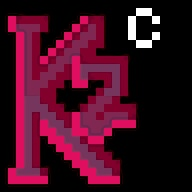
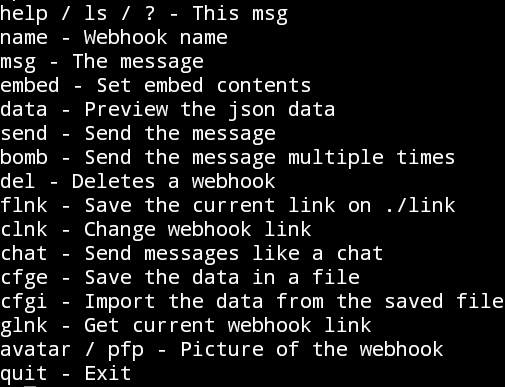
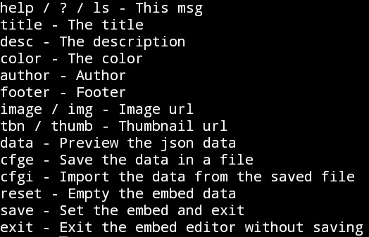

# killzwitch
## A CommandLine Discord webhook tool

It has many features, msg sets the text, name sets the name of the webhook and more:

It also has an embed creator with the following options:

The official page of the project is [this](https://cztc.rf.gd/) (under construction)
